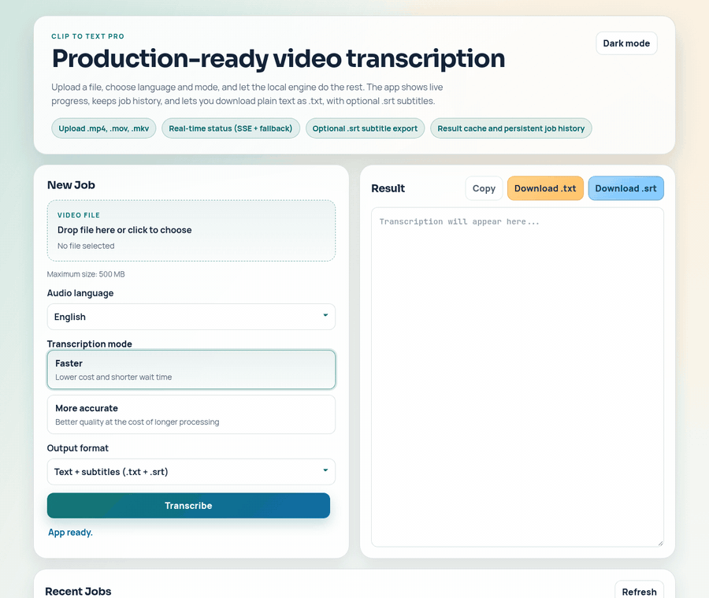
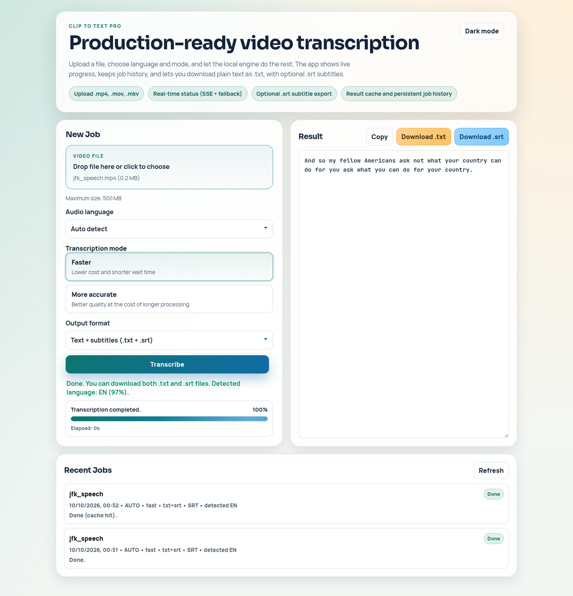
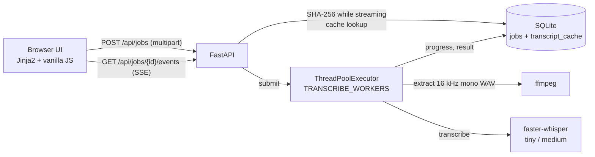

# Clip to Text Pro

Self-hosted web app that turns `.mp4` / `.mov` / `.mkv` recordings into text and `.srt` subtitles with a local Whisper model, so no audio leaves your machine.

[](https://github.com/MaciejZiel/clip_to_text/actions/workflows/ci.yml)
[](https://github.com/MaciejZiel/clip_to_text/actions/workflows/codeql.yml)
[](LICENSE)




*Real run on a laptop CPU with the `tiny` model: an 11-second clip, language auto-detected, `.txt` and `.srt` ready in about a second.*

## What it does

- **Background jobs with live progress.** An upload returns `202 Accepted` with a job id at once; a worker pool extracts audio with `ffmpeg` and transcribes it with `faster-whisper`, while the browser follows the job over Server-Sent Events (heartbeats included) and falls back to polling.
- **Two profiles, three languages.** "Faster" (`tiny`, greedy decoding) or "More accurate" (`medium`, beam search 5 + VAD); Polish, English or automatic language detection with the detected language and its probability in the result.
- **Text and subtitles.** Plain `.txt`, or `.txt` + `.srt` built from segment timestamps; both downloadable or available as JSON.
- **Remembers work.** Job history lives in SQLite and survives restarts; a transcript cache keyed by the file's SHA-256 and the model settings makes re-uploading the same clip instant.
- **Defensive by default.** Extension, MIME type and container magic bytes are checked, uploads are size-limited while streaming, the queue returns `429` when full, jobs can be cancelled, and jobs cut off by a restart are marked as interrupted instead of hanging.



## Architecture



Everything runs in one process: the API thread handles uploads and SSE, a bounded thread pool runs the CPU-heavy work, and loaded Whisper models are cached per profile so only the first job pays the load time.

## Tech stack

Python 3.10+, FastAPI, Uvicorn, faster-whisper (CTranslate2), ffmpeg/ffprobe, SQLite (WAL), Jinja2, vanilla JavaScript + CSS (light/dark), pytest + HTTPX, GitHub Actions.

## Quick start

Requires Python 3.10+ and `ffmpeg` on the `PATH` (`sudo apt-get install ffmpeg` or `brew install ffmpeg`).

```bash
git clone https://github.com/MaciejZiel/clip_to_text.git
cd clip_to_text
python -m venv .venv
source .venv/bin/activate
pip install -r requirements.txt
uvicorn app.main:app --host 127.0.0.1 --port 8000
```

Open <http://127.0.0.1:8000>. On first start the `tiny` model (about 75 MB) is downloaded from Hugging Face and preloaded; the `medium` model for the accurate profile is downloaded the first time that profile is used. Settings can be overridden with environment variables (see `.env.example` and the reference below).

### API

| Method | Path | Purpose |
| --- | --- | --- |
| `POST` | `/api/jobs` | Create a transcription job (`file`, `language=pl\|en\|auto`, `mode=fast\|accurate`, `output_format=txt\|txt_srt`) |
| `GET` | `/api/jobs` | Recent jobs |
| `GET` | `/api/jobs/{id}` | Job status, progress, queue position and ETA |
| `GET` | `/api/jobs/{id}/events` | Status stream (SSE) |
| `POST` | `/api/jobs/{id}/cancel` | Cancel a job |
| `GET` | `/api/jobs/{id}/result` | Result as JSON, including detected language |
| `GET` | `/api/jobs/{id}/subtitle` | SRT as plain text |
| `GET` | `/api/jobs/{id}/download?format=txt\|srt` | Download `.txt` or `.srt` |
| `POST` | `/api/transcribe` | Synchronous one-shot mode, no job history |
| `GET` | `/health` | Health and runtime metrics (queue, cache, ffmpeg availability) |

FastAPI also serves interactive docs at `/docs`.

<details>
<summary>Configuration reference (environment variables)</summary>

| Variable | Default | Meaning |
| --- | --- | --- |
| `MAX_UPLOAD_MB` | `500` | Upload size limit |
| `MAX_VIDEO_DURATION_SECONDS` | `0` (off) | Duration limit, checked with `ffprobe` |
| `MAX_PENDING_JOBS` | `64` | Queued + processing jobs before `429` |
| `WHISPER_FAST_MODEL` / `WHISPER_ACCURATE_MODEL` | `tiny` / `medium` | Model per profile |
| `WHISPER_DEVICE` | `auto` | `cpu`, `cuda` or `auto` |
| `WHISPER_COMPUTE_TYPE` | `int8` | CTranslate2 compute type, e.g. `float16` on GPU |
| `WHISPER_CPU_THREADS` / `WHISPER_NUM_WORKERS` / `WHISPER_BATCH_SIZE` | `0` / `1` / `1` | Model runtime tuning; batch size > 1 uses the batched pipeline |
| `WHISPER_FAST_VAD_FILTER` | `0` | VAD in the fast profile |
| `WHISPER_FAST_WITHOUT_TIMESTAMPS` / `WHISPER_ACCURATE_WITHOUT_TIMESTAMPS` | `1` / `1` | Skip timestamps for plain text (always on for `.srt`) |
| `TRANSCRIBE_WORKERS` | half the CPU cores, max 4 | Worker pool size |
| `PRELOAD_FAST_MODEL` / `PRELOAD_ACCURATE_MODEL` | `1` / `0` | Load models at startup |
| `JOB_TTL_SECONDS` | `7200` | In-memory job TTL |
| `JOB_RETENTION_SECONDS` | `604800` | Job retention in SQLite |
| `TRANSCRIPT_CACHE_TTL_SECONDS` / `TRANSCRIPT_CACHE_MAX_ITEMS` | `86400` / `256` | Transcript cache |
| `JOBS_DB_PATH` | `data/jobs.sqlite3` | SQLite file |
| `SSE_POLL_INTERVAL_SECONDS` / `SSE_MAX_SECONDS` / `SSE_HEARTBEAT_SECONDS` | `0.8` / `3600` / `12` | Event stream timing |
| `MAINTENANCE_INTERVAL_SECONDS` | `300` | Cleanup loop interval |
| `ETA_STATS_WINDOW` / `ETA_MIN_SAMPLES` / `ETA_CACHE_TTL_SECONDS` | `120` / `3` / `30` | ETA from recent completed jobs |
| `FFMPEG_BIN` / `FFPROBE_BIN` / `FFMPEG_THREADS` | `ffmpeg` / `ffprobe` / `0` | ffmpeg binaries and threads |
| `LOG_LEVEL` | `INFO` | Log level |

Example profiles:

```bash
# CPU, higher throughput
export WHISPER_DEVICE=cpu WHISPER_COMPUTE_TYPE=int8 WHISPER_FAST_MODEL=tiny \
       WHISPER_CPU_THREADS=8 WHISPER_NUM_WORKERS=2 TRANSCRIBE_WORKERS=2

# GPU, lowest single-job latency
export WHISPER_DEVICE=cuda WHISPER_COMPUTE_TYPE=float16 WHISPER_FAST_MODEL=tiny \
       WHISPER_BATCH_SIZE=8 TRANSCRIBE_WORKERS=1
```

`txt_srt` turns timestamps on, so it is slower than plain `txt`. ETA values are averages of recent completed jobs with the same profile and appear once `ETA_MIN_SAMPLES` jobs exist.

</details>

## Tests

```bash
pip install -r requirements.txt -r requirements-dev.txt
pytest -q
```

8 API smoke tests run against the ASGI app in-process with HTTPX (home page, `/health` shape, job listing, 404s for unknown jobs, rejection of invalid uploads, accepted `language=auto`). They don't download a model, so they run in about a second. CI runs them on Python 3.10 and 3.12 for every push and pull request.

## Key technical decisions

- **Thread pool instead of Celery/Redis.** Whisper inference releases the GIL inside CTranslate2, so threads give real parallelism and the app stays a single `uvicorn` process with no broker. The cost: jobs don't survive a restart (they are marked as interrupted) and work can't be spread over several machines.
- **SSE with a polling fallback instead of WebSockets.** Progress only flows server to client, SSE works over plain HTTP and through most proxies, and heartbeats keep long jobs from being cut by idle timeouts. If the stream drops, the UI polls `GET /api/jobs/{id}`.
- **Content-addressed cache.** The SHA-256 is computed while the upload is streamed to disk, so hashing costs no extra pass. The cache key also includes language, profile, output format, model, device and compute type, so changing any of them can't return a stale transcript.
- **SQLite for jobs and cache.** One file, WAL mode, no extra service, and history plus ETA statistics come from plain SQL. It fits a single-node tool; several app instances would need Postgres or similar.

## Limitations and next steps

- Single node only: the queue and loaded models live in one process.
- Cancellation is cooperative and takes effect between Whisper segments, not mid-segment.
- No authentication; it is meant for local or trusted-network use.
- The test suite covers the HTTP layer; the transcription pipeline (ffmpeg + model) is not exercised in CI.
- `app/main.py` holds the whole backend (about 1,900 lines); splitting it into storage, worker and API modules is the next refactor.

## License

MIT, see [LICENSE](LICENSE). Third-party components added to this repository are listed in [3rdparty_licenses.md](3rdparty_licenses.md).
